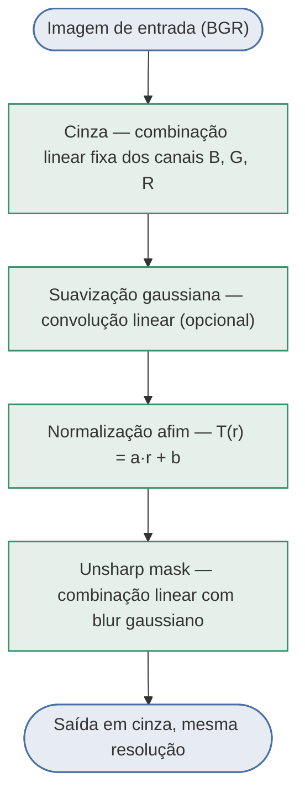
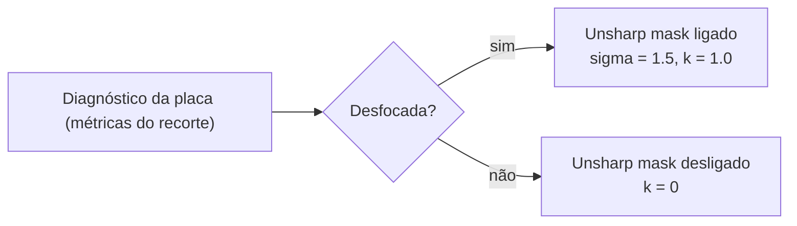

# Diagrama de Blocos — Pipeline de Pré-processamento

Os dois pipelines (`pipeline_global` e `pipeline_adaptive`, em `preprocessing_pipeline.py`) usam
exatamente a mesma cadeia de blocos lineares, chamada `run_linear_pipeline`. O que muda entre eles
é só **de onde vêm as estatísticas** da normalização afim e **se o unsharp mask liga ou não** — ver
a tabela depois do diagrama.

## Cadeia de blocos (comum às duas pipelines)

## O que diferencia Pipeline A (global) de Pipeline B (adaptativo)

| | Pipeline A — global | Pipeline B — adaptativo |
|---|---|---|
| Estatísticas da normalização afim (bloco D) | lidas da **cena inteira** | lidas do **recorte da placa** (bbox do nome do arquivo) |
| Suavização gaussiana (bloco C) | desligada (`smooth_sigma = 0`) | desligada (`smooth_sigma = 0`) |
| Unsharp mask (bloco E) | sempre ligado, mesmos parâmetros nas 100 imagens | só liga se o diagnóstico indicar `desfocada` |
| Usa a anotação da placa (bbox)? | não | só para ler as estatísticas do bloco D |

## Decisão do Pipeline B (único ponto condicional)

O ramo "ruidosa → suavização gaussiana" foi testado e **rejeitado** na calibração (seção 2.4 do
notebook: a métrica proposta piorava com ele ligado) — por isso não aparece como bloco condicional
aqui, embora o diagnóstico continue calculando a bandeira `ruidosa`.

---

Este mesmo diagrama (com os parâmetros numéricos resolvidos de cada bloco) também é gerado como
imagem dentro do notebook `vc_pratica1_grupo1.ipynb`, seção 2.1 — via `matplotlib`, então não
depende de o visualizador renderizar Mermaid.
