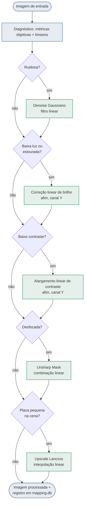

# License Plate Image Preprocessing

Pipeline de pré-processamento de imagens de placas veiculares (dataset no formato CCPD), usando **apenas filtros lineares**, com o objetivo de melhorar a qualidade de cada imagem de acordo com o problema específico que ela apresenta (baixa luz, superexposição, baixo contraste, desfoque, ruído ou placa pequena na cena), em vez de aplicar uma transformação genérica igual para todas.

**Equipe:** Ivan Edward, Elizabete Barbosa, Davi Melo

## Estrutura

- `vc_pratica1_grupo1.ipynb` — notebook único e entregável da prática: EDA das 100 imagens (parsing dos metadados CCPD, métricas objetivas de qualidade, categorização por problema dominante), comparação quantitativa de técnicas candidatas restritas a filtros lineares, diagrama de blocos da pipeline, execução do pipeline sobre as 100 imagens e a métrica de avaliação proposta com a análise dos resultados.
- `preprocessing_pipeline.py` — módulo com as funções de diagnóstico (`compute_metrics`, `diagnose`) e de correção — todas lineares: `linear_brightness_correction` (deslocamento aditivo do canal de luminância em YCrCb), `linear_contrast_stretch` (alargamento afim por percentis, também em YCrCb, com ganho limitado), `denoise_gaussian` (convolução Gaussiana), `unsharp_mask` (combinação linear com blur Gaussiano) e `upscale_lanczos` (interpolação linear) — mais os orquestradores `process_image` (uma imagem) e `process_folder` (lote completo).
- `images/` — dataset original (100 imagens).
- `images_processed/` — gerado ao rodar o pipeline (não versionado): imagens processadas + `mapping.db` (SQLite) com a relação imagem original ↔ processada, diagnóstico e métricas antes/depois.
- `images_processed_grupo1.zip` — gerado sob demanda para a entrega (não versionado): as 100 imagens processadas compactadas.
- `app.py` — interface Streamlit para explorar a pipeline interativamente (uma imagem por vez, com sliders para os parâmetros, ou o lote completo com métricas agregadas).
- `Pratica1_VC.pdf` — enunciado da prática.

## Diagrama de Blocos da Pipeline

Cada imagem passa pelo diagnóstico (limiares calibrados a partir da distribuição das 100 imagens,
ver Metodologia) e recebe **somente** as correções lineares indicadas pelas suas próprias métricas
— nunca um bloco único aplicado ao dataset inteiro.



## Ambiente

```bash
python3 -m venv venv
source venv/bin/activate
pip install -r requirements.txt
```

## Como rodar

Notebook (gera `images_processed/` e `mapping.db`):

```bash
jupyter nbconvert --to notebook --execute --inplace vc_pratica1_grupo1.ipynb
```

Para atualizar o `.zip` de entrega depois de rodar o notebook:

```bash
python -c "import zipfile; from pathlib import Path; zf = zipfile.ZipFile('images_processed_grupo1.zip', 'w', zipfile.ZIP_DEFLATED); [zf.write(f, arcname=f.name) for f in sorted(Path('images_processed').glob('*.jpg'))]"
```

Interface interativa (Streamlit) — abre no navegador em `http://localhost:8501`:

```bash
streamlit run app.py
```

A aba "Imagem única" deixa escolher uma imagem do dataset (ou enviar uma nova), ajustar os parâmetros de cada filtro linear pela barra lateral e ver diagnóstico, antes/depois e métricas em tempo real. A aba "Lote (100 imagens)" mostra a distribuição de correções, a taxa de sucesso da métrica proposta e permite navegar pelas 100 imagens já processadas (requer ter rodado o notebook antes, para existir `images_processed/mapping.db`).

## Metodologia

Os limiares de diagnóstico (`BRIGHTNESS_LOW`, `BRIGHTNESS_HIGH`, `CONTRAST_LOW`, `SHARPNESS_LOW`, `NOISE_HIGH`, `PLATE_AREA_LOW`) foram calibrados a partir da distribuição real das 100 imagens (média ± 0,5 desvio-padrão de cada métrica), documentados no notebook e congelados como constantes em `preprocessing_pipeline.py` para permitir avaliar uma imagem isolada sem depender do lote inteiro.

Cada imagem pode disparar mais de uma correção — elas são aplicadas em cadeia, na ordem: denoise (Gaussiano) → correção de exposição (deslocamento linear de brilho) → contraste (alargamento linear) → nitidez (unsharp mask) → upscale (Lanczos). Todas as operações são filtros lineares (convolução ou transformação afim ponto a ponto); nenhuma correção usa gamma, CLAHE, non-local means, bilateral, mediana ou IA generativa. Todas as correções são validadas com métricas objetivas de antes/depois, não apenas inspeção visual — ver a métrica de avaliação proposta no notebook (Parte 3).
